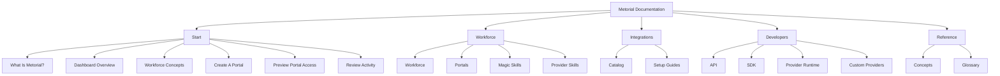
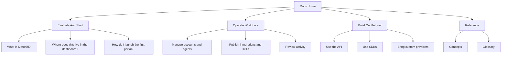
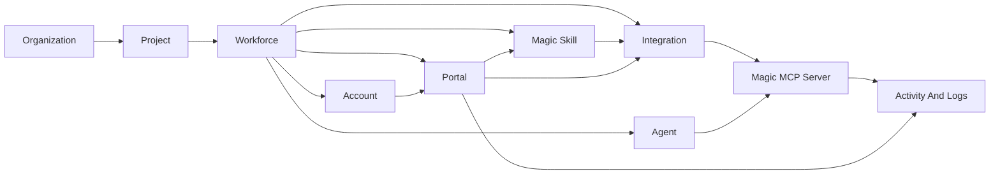

Use this page as an internal map for the docs structure. The public navigation now starts with Workforce outcomes and moves technical implementation material into developer sections.

## Navigation Layout

The Mintlify navigation is split into product-first tabs.

## Product Coverage

The main product surfaces map to these docs:

| Area | Documentation role | Start here |
| --- | --- | --- |
| Workforce | Control plane for governed tool access across people, agents, portals, skills, and activity | [Workforce](/product-workforce) |
| Portals | Branded user-facing catalogs for approved integrations, skills, and MCP access | [Portals](/product-portals) |
| Magic Skills | Reusable workflows that can be grouped, templated, governed, and published | [Magic Skills](/product-magic-skills) |
| Integrations | Approved tool access for catalog providers such as GitHub and Linear | [Integrations](/integrations-overview) |
| Magic MCP | Managed MCP endpoints, groups, tokens, and client connections | [Dashboard Overview](/dashboard-overview#magic-mcp) |
| Activity | Operational logs for sessions, connections, tool calls, provider runs, errors, alerts, and auth events | [Review Activity](/review-activity) |

## Reader Paths

For larger additions, keep new pages aligned with what the reader is trying to do.

## Product Model

This is the mental model the docs should teach.

## Editorial Rules

- Lead with user outcomes before API or object-model detail.
- Use **Workforce** for the product area that governs people, agents, portals, skills, and activity.
- Use **Portal** for the branded user-facing resource catalog.
- Use **Integration** for approved provider setup.
- Use **Magic MCP Server** for connectable MCP endpoints.
- Use **Account** for Workforce users or consumers in the dashboard UI.
- Use **Magic Skill** for reusable Workforce workflows, marketplaces, templates, and groups.
- Use **Provider skill** for provider summary bullets, not executable tools.

## Extending The Docs

1. Keep **Start** short and task-oriented.
2. Put durable product-area docs in **Workforce**.
3. Put API, SDK, provider runtime, and custom-provider material in **Developers**.
4. Add screenshots where they clarify current UI state.
5. Keep internal structure notes off the public navigation.
