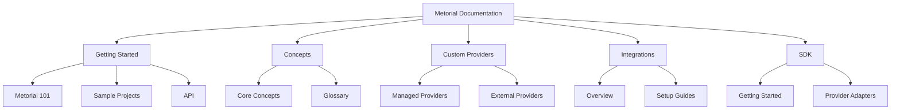
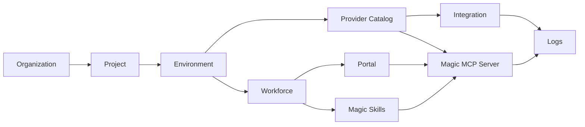

The docs currently explain the core Metorial flow well: create a workspace, configure providers, test in Explorer, use the SDKs, and monitor activity. The dashboard has grown beyond that original path, so the docs should separate **first-run onboarding**, **product areas**, **build guides**, and **reference material**.

## Current Layout

The current Mintlify navigation is organized around the original provider-first journey.

## Gaps To Close

The product now has several dashboard areas that deserve first-class documentation:

| Area | Current state | Recommended change |
| --- | --- | --- |
| Dashboard | Covered by the new dashboard overview page | Keep it as the orientation page for the app |
| Workforce | Visible in dashboard navigation, under-documented | Add product docs for accounts, agents, identities, and delegations |
| Portals | Exists in API/backend and custom portal app, not discoverable in docs | Add product docs for branded MCP marketplaces and consumer access |
| Magic Skills | Visible after starting a Workforce trial, not represented in docs | Add product docs for skills, marketplaces, templates, groups, and execution settings |
| Provider skills | Visible on provider pages as AI-generated summaries | Explain skills vs tools so users do not confuse catalog summaries with executable tool calls |
| Logs/Infra | Now covered by screenshots, still thin conceptually | Split into deeper observability and operations guides later |

## Recommended Layout

The improved structure should be organized by what the reader is trying to do.

```mermaid
flowchart TD
  A["Docs Home"]
  A --> B["Start"]
  B --> B1["Dashboard Overview"]
  B --> B2["Create organization and project"]
  B --> B3["Use provider"]
  B --> B4["Test and monitor"]

  A --> C["Product"]
  C --> C1["Providers and Integrations"]
  C --> C2["Magic MCP"]
  C --> C3["Workforce"]
  C --> C4["Portals"]
  C --> C5["Magic Skills"]
  C --> C6["Provider Skills"]
  C --> C7["Logs and Infrastructure"]

  A --> D["Build"]
  D --> D1["SDK Quickstart"]
  D --> D2["JavaScript SDK"]
  D --> D3["Python SDK"]
  D --> D4["OAuth"]
  D --> D5["API Keys"]
  D --> D6["Sample Projects"]

  A --> E["Operate"]
  E --> E1["Monitoring"]
  E --> E2["Security and tool filters"]
  E --> E3["Identity and access"]
  E --> E4["Enterprise BYO"]

  A --> F["Reference"]
  F --> F1["Glossary"]
  F --> F2["API reference"]
  F --> F3["Custom provider reference"]
```

## Product Model

This is the mental model the docs should teach.

## Editorial Rules

- Use **Dashboard** for the browser UI at `platform.metorial.com`.
- Use **Provider** for catalog entries such as GitHub, Linear, Slack, and Metorial Search.
- Use **Integration** for reusable provider setup.
- Use **Magic MCP Server** for connectable MCP endpoints.
- Use **Account** for Workforce users/consumers in the dashboard UI.
- Use **Magic Skill** for reusable Workforce skills, marketplaces, templates, and groups.
- Use **Provider skill** for provider summary bullets, not executable tools.

## Near-Term Improvements

1. Keep the current **Getting Started** path short and task-oriented.
2. Move product-area docs into the new **Product** tab.
3. Split advanced operational pages out of 101 docs once they become long.
4. Add screenshots only where they explain current UI state or reduce ambiguity.
5. Keep sample projects after setup docs, not before core concepts.
