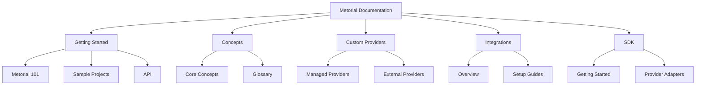
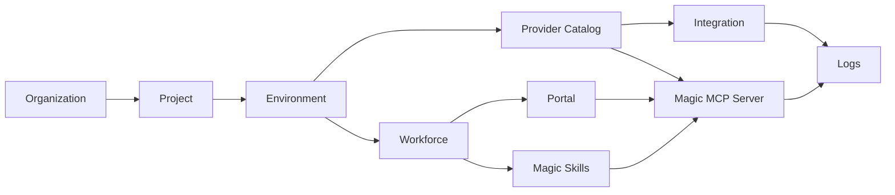

Use this page as a map of the docs and the product model they describe. The docs are organized around four reader goals: start with Metorial, understand the product areas, build with SDKs and APIs, and operate connected MCP infrastructure.

## Navigation Layout

The Mintlify navigation is split into task-oriented tabs.

## Product Coverage

The main product surfaces map to these docs:

| Area | Documentation role | Start here |
| --- | --- | --- |
| Dashboard | Orientation for onboarding, project setup, providers, integrations, Magic MCP, logs, infrastructure, and settings | [Dashboard Overview](/dashboard-overview) |
| Workforce | Identity and access model for accounts, agents, identities, delegations, portals, and skills | [Workforce](/product-workforce) |
| Portals | Branded consumer-facing MCP marketplaces for approved access | [Portals](/product-portals) |
| Magic Skills | Reusable Workforce skills, marketplaces, templates, groups, and execution policy | [Magic Skills](/product-magic-skills) |
| Provider skills | Provider-page capability summaries that help readers evaluate catalog entries | [Provider Skills](/product-provider-skills) |
| Logs and infrastructure | Operational surfaces for runs, tool calls, provider activity, deployments, credentials, networks, and auth config | [Dashboard Overview](/dashboard-overview#logs) |

## Reader Paths

For larger additions, keep new pages aligned with what the reader is trying to do.

```mermaid
flowchart TD
  A["Docs Home"]
  A --> B["Start"]
  B --> B1["Dashboard Overview"]
  B --> B2["Create organization and project"]
  B --> B3["Use provider"]
  B --> B4["Test and monitor"]

  A --> C["Product"]
  C --> C1["Providers and Integrations"]
  C --> C2["Magic MCP"]
  C --> C3["Workforce"]
  C --> C4["Portals"]
  C --> C5["Magic Skills"]
  C --> C6["Provider Skills"]
  C --> C7["Logs and Infrastructure"]

  A --> D["Build"]
  D --> D1["SDK Quickstart"]
  D --> D2["JavaScript SDK"]
  D --> D3["Python SDK"]
  D --> D4["OAuth"]
  D --> D5["API Keys"]
  D --> D6["Sample Projects"]

  A --> E["Operate"]
  E --> E1["Monitoring"]
  E --> E2["Security and tool filters"]
  E --> E3["Identity and access"]
  E --> E4["Enterprise BYO"]

  A --> F["Reference"]
  F --> F1["Glossary"]
  F --> F2["API reference"]
  F --> F3["Custom provider reference"]
```

## Product Model

This is the mental model the docs should teach.

## Editorial Rules

- Use **Dashboard** for the browser UI at `platform.metorial.com`.
- Use **Provider** for catalog entries such as GitHub, Linear, Slack, and Metorial Search.
- Use **Integration** for reusable provider setup.
- Use **Magic MCP Server** for connectable MCP endpoints.
- Use **Account** for Workforce users/consumers in the dashboard UI.
- Use **Magic Skill** for reusable Workforce skills, marketplaces, templates, and groups.
- Use **Provider skill** for provider summary bullets, not executable tools.

## Extending The Docs

1. Keep the current **Getting Started** path short and task-oriented.
2. Put durable product-area docs in the **Product** tab.
3. Split advanced operational pages out of 101 docs when they become long.
4. Add screenshots only where they explain current UI state or reduce ambiguity.
5. Keep sample projects after setup docs, not before core concepts.
