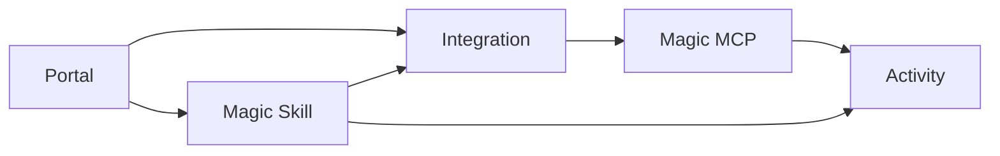

Workforce is where you decide how access should work after the project already exists. Start by understanding the core concepts, then choose the first portal, integration, Magic Skill, and access path you want to publish.

<Note>
  **What you'll learn:**

  - How to orient around the Workforce dashboard
  - What Portals, Integrations, Magic Skills, and Magic MCP are for
  - How those concepts fit together
  - How to choose the first concrete setup path
</Note>

## Open Workforce

Open **Workforce** from the dashboard. This is the control plane for portals, integrations, Magic Skills, Magic MCP access, and activity.

## Understand The Core Concepts

Workforce brings a few product concepts together. Read them from the user's point of view first: where they discover access, what tools are approved, which workflows are packaged for them, and how clients connect.

| Concept | What it means |
| --- | --- |
| Portal | A branded place where users discover approved integrations and Magic Skills |
| Integration | An approved connection to a tool such as GitHub or Linear |
| Magic Skill | A reusable workflow built on top of approved integrations and resources |
| Magic MCP | A managed MCP endpoint that lets agents or MCP clients connect to approved tool access |
| Activity | Logs for sessions, connections, tool calls, provider runs, errors, alerts, and auth events |

## Pick The First Resources

Keep the first setup small. Choose one or two integrations, one useful Magic Skill, and one access group. This makes it easier to test the consumer experience before expanding the portal or adding more clients.

Good first resources are:

- a GitHub or Linear integration
- one Magic Skill that solves a real repeated workflow
- one access group for the first user cohort
- one Magic MCP server if agents or MCP clients need direct connection

## Review Activity

After users or agents connect, use Logs to inspect sessions, connections, tool calls, provider runs, errors, alerts, and auth events.

## What's Next?

Create the portal your users will see first.

<Card title="Next Up: Launch A Portal" icon="door-open" href="/metorial-101-deploying">
  Publish a branded place for approved integrations and skills.
</Card>
