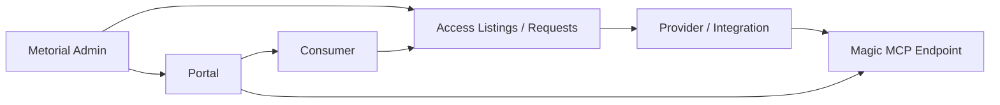
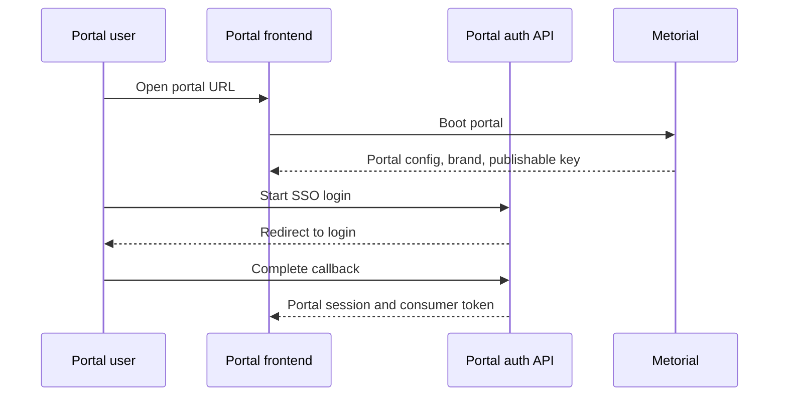

Portals let you create a branded, consumer-facing MCP marketplace for an organization or project. A portal can expose approved provider access, authenticate consumers, and connect those consumers to Magic MCP endpoints.

<Note>
  **What you'll learn:**

  - What a portal is
  - How portals connect consumers, provider access, and Magic MCP
  - Which API surfaces back portal configuration and authentication
</Note>

## What Portals Do

The portal API describes portals as custom branded MCP server marketplaces. In practice, a portal gives external users a controlled surface for discovering and connecting to the provider access you approve.

## Portal Building Blocks

| Building block | Purpose |
| --- | --- |
| Portal | Branded marketplace surface for one instance |
| Portal URL | Public URL generated from the portal slug/template |
| Consumer profiles | Consumer identities inside the portal surface |
| Consumer groups | Groups used to organize portal consumers |
| Access listings | Provider access shown or available to consumers |
| Access requests | Consumer requests for provider access |
| Portal auth | Login, SSO tenants, OAuth clients, and session handling |

## Authentication

Portals support authenticated and unauthenticated boot flows. When a consumer authenticates, Metorial issues portal tokens and consumer session tokens scoped to that portal surface.

## Magic MCP In Portals

Portals can expose a portal-aware Magic MCP URL. That lets consumers connect through portal-scoped routes rather than directly through an internal project route.

Use portal-connected Magic MCP when:

- access should be consumer-specific
- the connection should honor portal authentication
- customers need a branded entry point
- you want provider access listings and requests around MCP access

## API Surfaces

The core API includes portal endpoints for:

- listing, creating, updating, and archiving portals
- managing portal auth apps and SSO tenants
- managing consumer groups, profiles, invites, access listings, and access requests
- creating portal provider templates and portal-owned Magic MCP access

<Warning>
  Portal endpoints are currently feature-gated behind portal access flags. If a dashboard or API call does not expose portals, confirm the project has portal access enabled.
</Warning>

## Related Pages

<CardGroup cols={2}>
  <Card title="Workforce" icon="users" href="/product-workforce">
    Understand the accounts and identities that portals connect to.
  </Card>

  <Card title="Magic MCP" icon="wand-sparkles" href="/dashboard-overview#magic-mcp">
    See where Magic MCP servers live in the dashboard.
  </Card>
</CardGroup>
