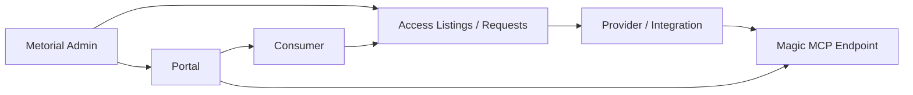
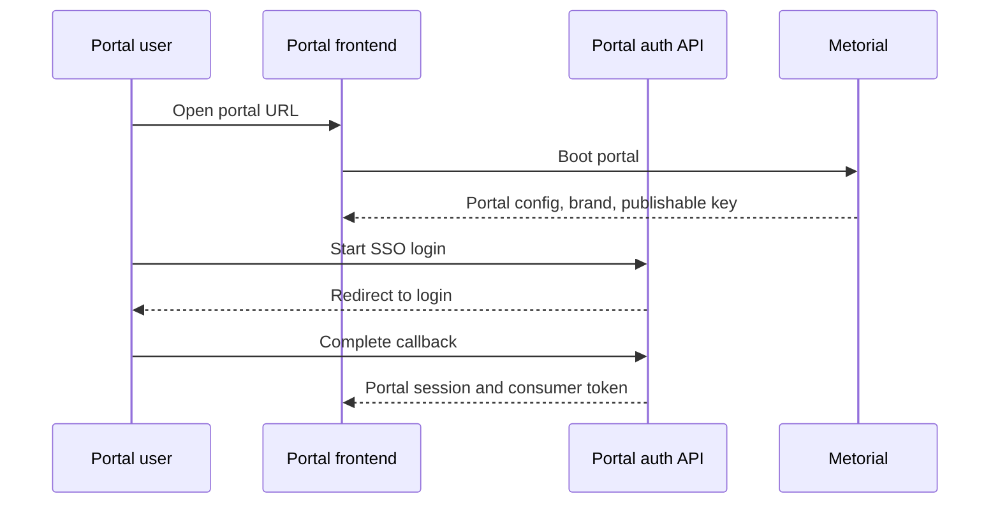

Portals let you create a branded, consumer-facing MCP marketplace for an organization or project. A portal can expose approved provider access, authenticate consumers, and connect those consumers to Magic MCP endpoints.

In the dashboard, Portals are part of the Workforce product. After starting a Workforce trial, open **Workforce → Portals** to create and manage them.

<Note>
  **What you'll learn:**

  - What a portal is
  - How portals connect consumers, provider access, and Magic MCP
  - Which API surfaces back portal configuration and authentication
</Note>

## What Portals Do

The portal API describes portals as custom branded MCP server marketplaces. In practice, a portal gives external users a controlled surface for discovering and connecting to the provider access you approve.

## Portal Building Blocks

| Building block | Purpose |
| --- | --- |
| Portal | Branded marketplace surface for one instance |
| Portal URL | Public URL generated from the portal slug/template |
| Consumer profiles | Consumer identities inside the portal surface |
| Consumer groups | Groups used to organize portal consumers |
| Access listings | Provider access shown or available to consumers |
| Access requests | Consumer requests for provider access |
| Portal auth | Login, SSO tenants, OAuth clients, and session handling |

## Create A Portal

The dashboard create flow starts with two fields:

| Field | Purpose |
| --- | --- |
| Name | Display name for the branded portal |
| Description | Short explanation of who the portal is for or what access it exposes |

Create the portal first, then configure the access listings, auth, consumer profiles, and provider templates that shape what users can see.

## Access Groups

Use **Access → Groups** to define which consumers can see each portal resource. Groups can be assigned to every account by default or matched from SSO group IDs.

After you create a resource listing, open the listing and explicitly set each access group to **Allow** or **Deny**. New listings can start denied until you choose the group access policy.

## Resource Listings

Use **Resources** to publish the integrations and skills that consumers can discover in the portal.

### Integrations

Integration listings can be:

| Listing type | Meaning |
| --- | --- |
| User-configured | Each portal account connects the integration with their own credentials |
| Pre-configured | Administrators manage the shared credentials and provider settings |

### Skills

Skill listings expose Magic Skills through the portal. A skill can link to integrations, so the consumer sees which provider access powers the workflow.

### Highlights

Highlights organize selected resources on the portal home page. Use them to promote recommended starter kits, department workflows, or curated app bundles.

## Authentication

Portals support authenticated and unauthenticated boot flows. When a consumer authenticates, Metorial issues portal tokens and consumer session tokens scoped to that portal surface.

The dashboard authentication settings include SSO tenants, email/domain allowlists, and session expiry controls.

Consumers authenticate before seeing portal resources.

## Magic MCP In Portals

Portals can expose a portal-aware Magic MCP URL. That lets consumers connect through portal-scoped routes rather than directly through an internal project route.

Use portal-connected Magic MCP when:

- access should be consumer-specific
- the connection should honor portal authentication
- customers need a branded entry point
- you want provider access listings and requests around MCP access

## Consumer Portal

Consumers open the portal URL, authenticate, and land on a branded workspace that shows the Magic MCP URL, highlighted resources, available integrations, and shared skills.

The integrations view lists approved integrations and their availability state.

The skills view lists shared Magic Skills and the integrations they use.

## API Surfaces

The core API includes portal endpoints for:

- listing, creating, updating, and archiving portals
- managing portal auth apps and SSO tenants
- managing consumer groups, profiles, invites, access listings, and access requests
- creating portal provider templates and portal-owned Magic MCP access

<Warning>
  Portal endpoints are currently feature-gated behind portal access flags. If a dashboard or API call does not expose portals, confirm the project has portal access enabled.
</Warning>

## Related Pages

<CardGroup cols={2}>
  <Card title="Workforce" icon="users" href="/product-workforce">
    Understand the accounts and identities that portals connect to.
  </Card>

  <Card title="Magic MCP" icon="wand-sparkles" href="/dashboard-overview#magic-mcp">
    See where Magic MCP servers live in the dashboard.
  </Card>
</CardGroup>
