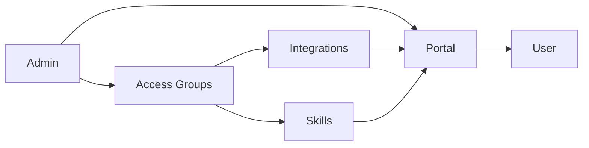

Portals turn a Workforce setup into a user-facing experience. Create a portal for a customer, partner, department, or internal team, then publish the integrations and skills that group should use.

<Note>
  **What you'll learn:**

  - How admins build a portal
  - How users experience a portal
  - How access groups, integrations, skills, highlights, and authentication fit together
</Note>

## Portal Journey

Admins create the portal and decide what appears inside it. Users open the portal, authenticate, and connect to the approved resources.

## Create A Portal

Open **Portals** from Workforce and create a portal with a clear name and description. Use the description to explain who the portal is for and what kind of work it supports.

## Add Access Groups

Access groups decide which users can see each portal resource. Groups can apply to every account by default or match SSO group IDs.

After adding a resource, open the resource and explicitly allow the groups that should see it.

## Add Integrations

Publish integrations so users can connect approved tools. A portal integration can be:

| Listing type | Meaning |
| --- | --- |
| User-configured | Each user connects the integration with their own credentials |
| Pre-configured | Administrators manage the shared credentials and provider settings |

## Add Skills

Publish skills so users can run approved workflows. Skills can show linked integrations, which helps users understand what access powers the workflow.

## Highlight Starter Resources

Highlights organize selected resources on the portal home page. Use them for recommended workflows, starter kits, or department-specific bundles.

## Configure Authentication

Portal authentication controls who can enter the portal. Configure SSO tenants, email or domain allowlists, and session expiry settings.

Users authenticate before they see portal resources.

## Test The Consumer Experience

Open the portal as a user and check the home page, integrations view, and skills view.

## Magic MCP In Portals

Portals can expose portal-aware Magic MCP access. Use this when users should connect MCP clients through a branded, authenticated surface rather than a project-internal endpoint.

Use portal-connected Magic MCP when:

- access should be user-specific
- the connection should honor portal authentication
- users need a branded entry point
- resource listings and requests should wrap MCP access

## Related Pages

<CardGroup cols={2}>
  <Card title="Create A Portal" icon="door-open" href="/metorial-101-deploying">
    Follow the first portal setup path.
  </Card>
  <Card title="Magic Skills" icon="wand-sparkles" href="/product-magic-skills">
    Publish reusable workflows through portals.
  </Card>
  <Card title="Workforce" icon="users" href="/product-workforce">
    Understand the broader Workforce access model.
  </Card>
  <Card title="Integrations" icon="plug" href="/integrations-overview">
    Configure the tools users can access.
  </Card>
</CardGroup>
