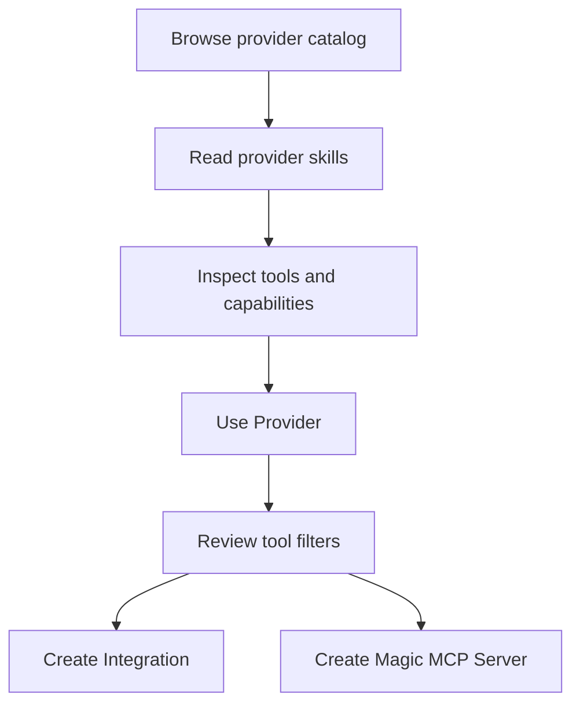

Provider skills are the short capability bullets shown on provider pages. They help you quickly understand what a provider is good at before inspecting its tools, versions, or setup options.

These are different from [Magic Skills](/product-magic-skills), which are reusable Workforce assets that teams create and govern.

<Note>
  **What you'll learn:**

  - What provider skills are
  - How skills differ from tools
  - Where skills fit into provider selection and tool filtering
</Note>

## Skills In The Dashboard

Provider pages show a **Provider Summary** section. The dashboard code treats this as an AI-generated overview of the provider's capabilities and features.

Examples from the dashboard include summaries such as:

- create and manage issues
- manage projects and milestones
- manage cycles and sprints
- manage repositories
- create pull requests
- star repositories

## Skills Versus Tools

Skills are not executable tool calls. They are summaries that help you decide whether a provider is relevant.

| Concept | Meaning |
| --- | --- |
| Provider skill | Human-readable capability summary on a provider page |
| Magic Skill | Reusable Workforce skill created and governed by your team |
| Tool | Executable MCP capability with an input/output schema |
| Tool filter | Policy that allows, rejects, or mixes specific tools during setup |
| Integration | Reusable configured provider setup |
| Magic MCP Server | Connectable MCP endpoint built from provider access |

## Selection Flow

## Tool Filters

Provider setup groups tools into read-only, write, and destructive categories. For providers such as GitHub and Linear, this is where the broad skill summary becomes concrete access control.

Use skills to choose a provider. Use tools and tool filters to decide what an agent is allowed to do.

## Related Pages

<CardGroup cols={2}>
  <Card title="Providers" icon="plug" href="/concepts-providers">
    Learn how providers, integrations, configs, and auth configs fit together.
  </Card>

  <Card title="Using Your First Provider" icon="server" href="/metorial-101-deploying">
    Walk through the current provider setup flow.
  </Card>
</CardGroup>
