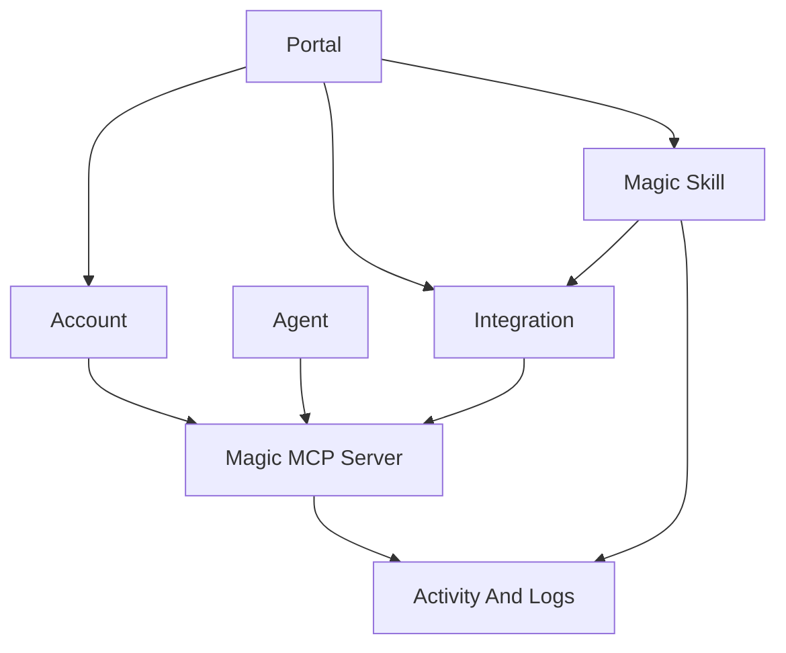

Workforce is where admins turn approved AI access into something employees and agents can actually use. It brings together portals, integrations, skills, Magic MCP, accounts, agents, and activity so access is governed from one place instead of scattered across credentials and one-off setup.

<Note>
  **What you'll learn:**

  - What Workforce manages for admins, employees, AI clients, and agents
  - How portals, integrations, skills, accounts, agents, and Magic MCP fit together
  - Which dashboard areas support the main Workforce workflow
</Note>

## What Workforce Is For

Use Workforce when you need to answer practical access questions:

- Which employees or agents can use approved tools?
- Which integrations and skills should users see?
- Which portal should a customer, partner, or internal team open?
- Which MCP clients can connect through approved access?
- Which sessions, connections, tool calls, and auth events happened?

## What You Can Manage

| Area | What it does |
| --- | --- |
| Portals | Publish branded catalogs of approved integrations and skills |
| Skills | Create and govern reusable workflows |
| Integrations | Configure approved access to tools such as GitHub and Linear |
| Magic MCP | Expose approved provider access through managed MCP endpoints |
| Accounts | Manage employees or users that receive portal access |
| Agents | Manage non-human actors and linked clients |
| Activity | Review usage, sessions, connections, tool calls, and errors |

## Core Workflow

Most teams start with this path:

<Steps>
  <Step title="Open Workforce">
    Start from the Workforce dashboard for the project you want to configure.
  </Step>
  <Step title="Launch a portal">
    Create the branded place where users will discover approved integrations and skills.
  </Step>
  <Step title="Add integrations and skills">
    Publish the tools and workflows users need. Start with a small set, then expand as usage becomes clear.
  </Step>
  <Step title="Test as a user">
    Open the employee portal and confirm the right resources are visible.
  </Step>
  <Step title="Review activity">
    Inspect sessions, connections, tool calls, provider runs, auth events, and alerts.
  </Step>
</Steps>

## Dashboard Surfaces

The Workforce product spans these dashboard areas:

| Area | Route | What it manages |
| --- | --- | --- |
| Workforce | `/workforce` | Activity, portals, accounts, and access overview |
| Portals | `/portals` | Branded resource catalogs for employees, partners, or customers |
| Magic Skills | `/skills` | Skills, marketplaces, templates, groups, and skill policy |
| Magic MCP | `/magic-mcp` | MCP servers, connections, groups, and tokens |
| Accounts | `/consumers` | Employees or users that can receive access |
| Agents | `/agents` | First-class agent actors and linked clients |
| Identity | `/identities`, `/actors`, `/identity/delegations`, `/identity/delegation-configs` | Identities, actors, delegations, and delegation configs |

## How The Pieces Fit

Portals are the user-facing surface. Integrations provide approved tool connections. Skills package repeatable workflows. Magic MCP gives AI clients and agents a standard MCP endpoint for approved access. Accounts and agents represent who or what can use access. Activity and logs trace usage, tool calls, and access events.

## Identity And Delegation

Workforce also includes lower-level identity and delegation pages. Use them when you need durable ownership for employees, agents, customer-facing users, or delegated access relationships.

| Page | What it manages |
| --- | --- |
| Accounts | Employees or users that can receive access |
| Agents | Non-human actors and linked clients |
| Identities | Identity records used for ownership and delegation |
| Delegations | Access relationships between identities |
| Delegation Configs | Reusable policies for identity delegation |

## Related Pages

<CardGroup cols={2}>
  <Card title="Portals" icon="door-open" href="/product-portals">
    Publish approved integrations and skills through a branded user surface.
  </Card>
  <Card title="Magic Skills" icon="wand-sparkles" href="/product-magic-skills">
    Create reusable workflows and publish them to teams or customers.
  </Card>
  <Card title="Integrations" icon="plug" href="/integrations-overview">
    Connect the tools your Workforce users need.
  </Card>
  <Card title="Review Activity" icon="chart-line" href="/review-activity">
    Monitor access usage and operational events.
  </Card>
</CardGroup>
