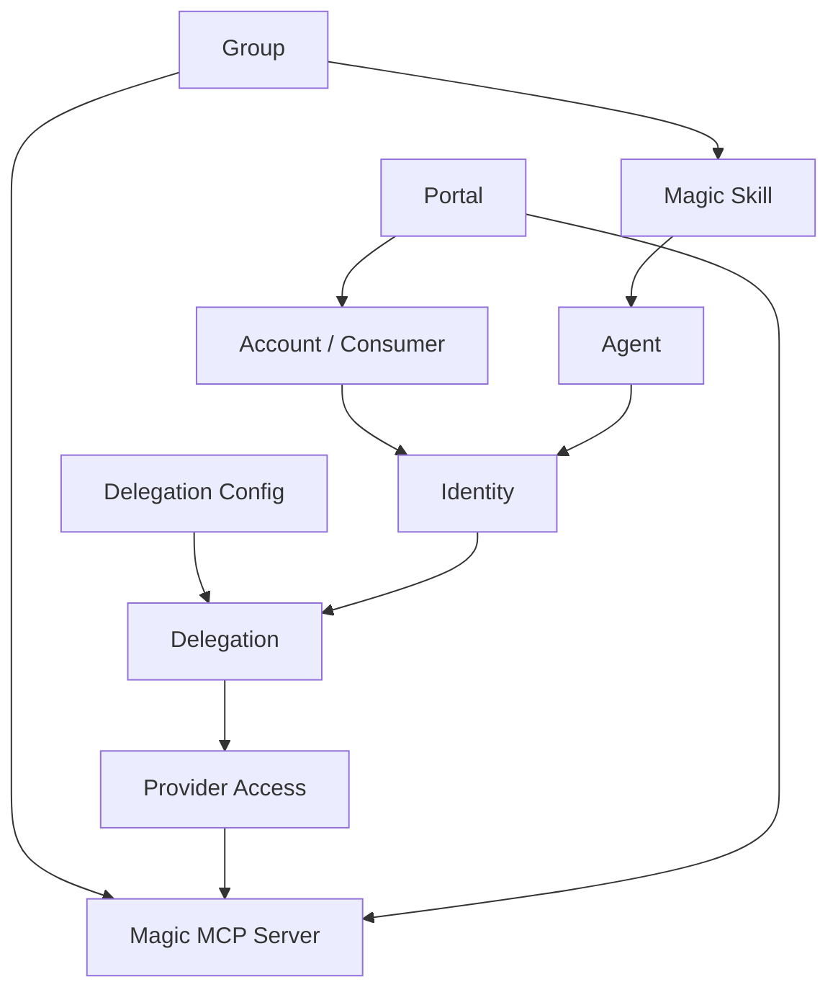

Workforce is where you manage who or what can act inside Metorial. It brings together portals, Magic Skills, Magic MCP access, human accounts, agent actors, identities, and delegation policies so access can be modeled explicitly instead of hidden inside API keys or provider credentials.

<Note>
  **What you'll learn:**

  - How Workforce relates to accounts, agents, identities, and delegations
  - Where Workforce, Portals, Magic Skills, Magic MCP, Identity, Accounts, and Agents live
  - How Workforce connects people, agents, skills, portals, and Magic MCP access
</Note>

## Workforce Home

Open **Workforce** from the top navigation to review workforce activity, portals, accounts, and access surfaces. The Workforce home page brings together:

- governed portals
- managed access
- workforce activity
- Magic Skills
- SAML SSO

The Workforce dashboard includes connection activity, a Portals card, and the Accounts table.

## Dashboard Surfaces

After Workforce is active, the dashboard exposes these Workforce product areas:

| Area | Route | What it manages |
| --- | --- | --- |
| Workforce | `/workforce` | Activity, portals, and account overview |
| Portals | `/portals` | Branded provider catalogs for employees, partners, or customers |
| Magic Skills | `/skills` | Reusable skills, marketplaces, templates, groups, and skill policy |
| Magic MCP | `/magic-mcp` | MCP servers, connections, groups, and tokens |
| Accounts | `/consumers` | People or consumers that can receive access across Metorial |
| Agents | `/agents` | First-class agents and linked clients |
| Identity | `/identities`, `/actors`, `/identity/delegations`, `/identity/delegation-configs` | Identities, actors, delegations, and delegation configs |

The concrete identity management pages are:

| Page | What it manages |
| --- | --- |
| Accounts | People or consumers that can receive access across Metorial |
| Agents | First-class agents and linked clients |
| Identities | Identity records used for ownership and delegation |
| Delegations | Access relationships between identities |
| Delegation Configs | Reusable policies for identity delegation |

## Magic Skills

Magic Skills appear inside Workforce. They are reusable skills that can enable workflows across agents and teams.

The Magic Skills section includes:

| Tab | What it manages |
| --- | --- |
| Skills | Reusable skills built from integrations, documents, custom logic, and resources |
| Marketplaces | Curated places to publish selected plugins and skills to users |
| Templates | Reusable starting points for new skills |
| Groups | Sets of related skills managed together |
| Settings | Default skill execution policy |

See [Magic Skills](/product-magic-skills) for the detailed walkthrough.

## Magic MCP Groups And Tokens

Workforce also exposes the Magic MCP access-management pages. **Groups** organize Magic MCP servers, while **Tokens** can include group restrictions.

## How Workforce Fits

## Accounts

Accounts represent consumers that can receive access across Metorial. In the dashboard, the Accounts page is labeled **Accounts** and lets you create and inspect consumer access records.

Use accounts when you need to model access for people outside your internal Metorial organization, such as customers, end users, or partner users.

## Agents

Agents represent non-human actors and linked clients. Use them when you want access to be owned by a durable agent identity instead of a person or raw API key.

## Identities And Delegation

Identities and delegation configs let you model who can act as whom, and under which policies. This matters when tools can read, write, or perform destructive actions.

## Related Pages

<CardGroup cols={2}>
  <Card title="Portals" icon="door-open" href="/product-portals">
    Let customers access approved providers through a branded portal.
  </Card>

  <Card title="Magic Skills" icon="wand-sparkles" href="/product-magic-skills">
    Create and govern reusable skills, marketplaces, templates, and groups.
  </Card>

  <Card title="Provider Skills" icon="sparkles" href="/product-provider-skills">
    Understand provider summaries and how they differ from tools.
  </Card>
</CardGroup>
