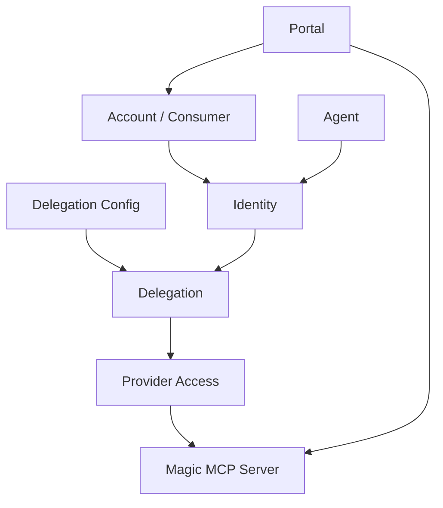

Workforce is where you manage who or what can act inside Metorial. It brings together human accounts, agent actors, identities, and delegation policies so access can be modeled explicitly instead of hidden inside API keys or provider credentials.

<Note>
  **What you'll learn:**

  - How Workforce relates to accounts, agents, identities, and delegations
  - Where Workforce appears in the dashboard
  - How Workforce connects to Portals and Magic MCP
</Note>

## Dashboard Surfaces

The dashboard currently exposes Workforce through the top navigation and through the Identity section under Infra.

The concrete Workforce management pages are:

| Page | What it manages |
| --- | --- |
| Accounts | People or consumers that can receive access across Metorial |
| Agents | First-class agents and linked clients |
| Identities | Identity records used for ownership and delegation |
| Delegations | Access relationships between identities |
| Delegation Configs | Reusable policies for identity delegation |

## How Workforce Fits

## Accounts

Accounts represent consumers that can receive access across Metorial. In the dashboard, the Accounts page is labeled **Accounts** and lets you create and inspect consumer access records.

Use accounts when you need to model access for people outside your internal Metorial organization, such as customers, end users, or partner users.

## Agents

Agents represent non-human actors and linked clients. Use them when you want access to be owned by a durable agent identity instead of a person or raw API key.

## Identities And Delegation

Identities and delegation configs let you model who can act as whom, and under which policies. This matters when tools can read, write, or perform destructive actions.

<Warning>
  Workforce and identity management may be plan or flag gated in some projects. If the dashboard shows an upgrade or unavailable state, enable the required product access before building flows that depend on these pages.
</Warning>

## Related Pages

<CardGroup cols={2}>
  <Card title="Portals" icon="door-open" href="/product-portals">
    Let customers access approved providers through a branded portal.
  </Card>

  <Card title="Provider Skills" icon="sparkles" href="/product-provider-skills">
    Understand provider summaries and how they differ from tools.
  </Card>
</CardGroup>
