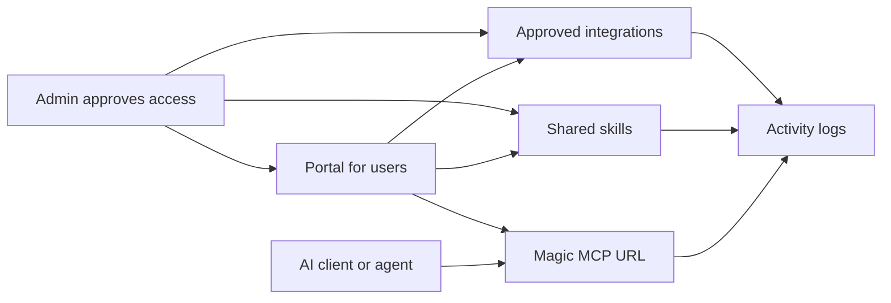

Workforce is the control plane for governed AI connectivity. Admins choose which integrations and skills are approved, users connect their tools through portals, AI clients and agents connect through standard MCP URLs, and activity logs trace usage, tool calls, and access events.

<Note>
  **What you'll learn:**

  - Who uses Workforce and what each person gets from it
  - What portals, integrations, skills, Magic MCP, accounts, agents, and activity mean
  - How the first portal setup fits together
  - Where to go after the concepts are clear
</Note>

## The Problem Workforce Solves

AI agents and applications need access to the tools where work happens, but unmanaged access quickly becomes difficult to approve, explain, and audit. Workforce gives teams one place to decide which integrations are allowed, who can use them, how users connect them, and how usage is traced.

Use Workforce when you want to:

- publish approved integrations such as GitHub or Linear
- give users a portal where they can discover and connect those tools
- package repeatable workflows as skills
- give AI clients, MCP clients, and CLIs a standard MCP URL for approved access
- review traces, sessions, tool calls, auth events, and errors

## Who Uses Workforce

| Actor | What they need from Metorial |
| --- | --- |
| Admin | A control plane for approved integrations, portals, skills, access groups, and tracing |
| User | A portal for connecting authorized tools and discovering shared skills |
| Agent, AI client, MCP client, or CLI | A standard MCP connection URL with access scoped to authorized tools |
| Developer | APIs and SDKs for automating the same governed access model |

## How Workforce Works

Open **Workforce** from the dashboard. This is where admins manage the connection layer that users, AI clients, and agents rely on.

At a high level, the flow looks like this:

## Core Concepts

Read these from the user's point of view first: where users authorize tools, which integrations are approved, which workflows are packaged for them, how AI clients connect, and how admins trace usage.

| Concept | What it means |
| --- | --- |
| Portal | A branded place where users connect authorized integrations and discover skills |
| Integration | An approved connection to a tool such as GitHub or Linear |
| Skill | A reusable workflow built on approved integrations, files, and instructions |
| Magic MCP URL | A standard MCP connection URL for AI clients, agents, MCP clients, and CLIs |
| Account | The employee or user record that receives portal access |
| Agent | A non-human actor or linked client that needs durable access to approved integrations |
| Activity | Traces and logs for sessions, connections, tool calls, errors, and auth events |

## The First Portal Pattern

The clearest first setup is small: one portal, one user group, one or two integrations, and one useful skill. That gives users a concrete place to authorize tools, while keeping the first review easy to test.

<Steps>
  <Step title="Create the portal">
    Give users a recognizable place to connect authorized tools and discover approved skills.
  </Step>
  <Step title="Add integrations">
    Publish the first approved tools, such as GitHub or Linear, and decide whether users connect their own accounts or admins manage shared credentials.
  </Step>
  <Step title="Add a skill">
    Package one repeated workflow so users can understand the value of the portal without needing to learn the whole system at once.
  </Step>
  <Step title="Preview as a user">
    Open the portal from the user side and confirm the right integrations, skills, and standard MCP URL are visible.
  </Step>
  <Step title="Review activity">
    Check activity logs after testing so admins can see traces, sessions, tool calls, auth events, and errors.
  </Step>
</Steps>

## What's Next?

Create the portal your users will see first, then preview it before sharing it broadly.

<CardGroup cols={2}>
  <Card title="Create A Portal" icon="door-open" href="/create-portal">
    Publish a branded place for approved integrations and skills.
  </Card>
  <Card title="Preview Portal Access" icon="vial" href="/preview-portal-access">
    Review the user portal before sharing it broadly.
  </Card>
  <Card title="Integrations" icon="plug" href="/integrations-overview">
    Choose the tools, auth method, and access policy users will rely on.
  </Card>
  <Card title="Skills" icon="wand-sparkles" href="/product-magic-skills">
    Package repeatable workflows that users can discover in the portal.
  </Card>
</CardGroup>
