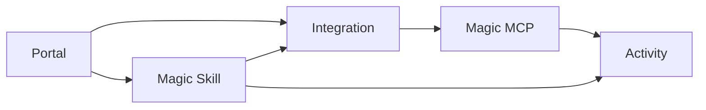

Workforce is where you decide how employees, agents, and external users should access company tools. Start by understanding the core concepts, then create the first portal your users will open.

<Note>
  **What you'll learn:**

  - How to orient around the Workforce dashboard
  - What Portals, Integrations, Magic Skills, and Magic MCP are for
  - How those concepts fit together
  - How to start with a small portal setup
</Note>

## Open Workforce

Open **Workforce** from the dashboard. This is the control plane for portals, integrations, Magic Skills, Magic MCP access, and activity.

## Understand The Core Concepts

Workforce brings a few product concepts together. Read them from the user's point of view first: where they discover access, what tools are approved, which workflows are packaged for them, and how clients connect.

| Concept | What it means |
| --- | --- |
| Portal | A branded place where users discover approved integrations and Magic Skills |
| Integration | An approved connection to a tool such as GitHub or Linear |
| Magic Skill | A reusable workflow built on top of approved integrations and resources |
| Magic MCP | A managed MCP endpoint that lets agents or MCP clients connect to approved tool access |
| Activity | Logs for sessions, connections, tool calls, provider runs, errors, alerts, and auth events |

## Plan Your First Portal

The clearest first setup is a portal with one or two integrations and one useful Magic Skill. That gives employees a concrete place to discover approved access, and it keeps the first review small enough to test.

Start with:

- one portal for the first employee group
- one GitHub or Linear integration
- one Magic Skill that solves a real repeated workflow
- one access group for the first employee cohort

<CardGroup cols={2}>
  <Card title="Create A Portal" icon="door-open" href="/create-portal">
    Create the branded place where employees discover approved integrations and skills.
  </Card>
  <Card title="Integrations" icon="plug" href="/integrations-overview">
    Choose the tools, auth method, and access policy that the portal will expose.
  </Card>
  <Card title="Magic Skills" icon="wand-sparkles" href="/product-magic-skills">
    Package repeatable workflows that employees can discover in the portal.
  </Card>
  <Card title="Magic MCP" icon="sparkles" href="/dashboard-overview#magic-mcp">
    Connect agents or MCP clients when they need direct tool access.
  </Card>
</CardGroup>

## What's Next?

Create the portal your employees will see first.

<Card title="Next Up: Create A Portal" icon="door-open" href="/create-portal">
  Publish a branded place for approved integrations and skills.
</Card>
