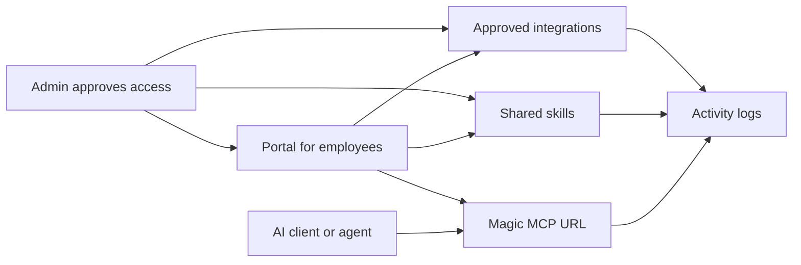

Workforce is the control plane for approved tool access. Admins choose what is available, employees connect the tools and skills they need, agents use managed MCP access, and activity logs trace usage, tool calls, and access events.

<Note>
  **What you'll learn:**

  - Who uses Workforce and what each person gets from it
  - What portals, integrations, skills, Magic MCP, accounts, agents, and activity mean
  - How the first portal setup fits together
  - Where to go after the concepts are clear
</Note>

## The Problem Workforce Solves

AI tools and agents need access to company systems, but unmanaged access quickly becomes difficult to approve, explain, and audit. Workforce gives teams one place to decide which tools are allowed, who can use them, how employees connect them, and how usage is monitored.

Use Workforce when you want to:

- publish approved integrations such as GitHub or Linear
- give employees a portal where they can discover and connect those tools
- package repeatable workflows as skills
- give AI clients and agents a standard MCP URL with governed access
- review sessions, tool calls, provider runs, auth events, alerts, and errors

## Who Uses Workforce

| Actor | What they need from Metorial |
| --- | --- |
| Admin | A control plane for approved tools, portals, skills, access groups, and activity |
| Employee | A simple place to connect approved apps and use shared skills |
| Agent or AI client | A standard MCP connection URL with access scoped to approved tools |
| Developer | APIs and SDKs for automating the same governed access model |

## How Workforce Works

Open **Workforce** from the dashboard. This is where admins manage the product surfaces employees and agents will use.

At a high level, the flow looks like this:

## Core Concepts

Read these from the user's point of view first: where employees discover access, what tools are approved, which workflows are packaged for them, how AI clients connect, and how admins audit usage.

| Concept | What it means |
| --- | --- |
| Portal | A branded place where employees discover approved integrations and skills |
| Integration | An approved connection to a company tool such as GitHub or Linear |
| Skill | A reusable workflow built on approved integrations and resources |
| Magic MCP URL | A standard MCP connection URL for AI clients and agents, scoped to approved access |
| Account | The employee or user record that receives portal access |
| Agent | A non-human actor or linked client that needs durable tool access |
| Activity | Logs for sessions, connections, tool calls, provider runs, errors, alerts, and auth events |

## The First Portal Pattern

The clearest first setup is small: one portal, one employee group, one or two integrations, and one useful skill. That gives employees a concrete place to discover approved access, while keeping the first review easy to test.

<Steps>
  <Step title="Create the portal">
    Give employees a recognizable place to find the tools and skills approved for their work.
  </Step>
  <Step title="Add integrations">
    Publish the first approved tools, such as GitHub or Linear, and decide whether employees connect their own accounts or admins manage shared credentials.
  </Step>
  <Step title="Add a skill">
    Package one repeated workflow so employees can understand the value of the portal without needing to learn the whole system at once.
  </Step>
  <Step title="Preview as an employee">
    Open the portal from the user side and confirm the right integrations, skills, and Magic MCP URL are visible.
  </Step>
  <Step title="Review activity">
    Check activity logs after testing so admins can see sessions, connections, tool calls, provider runs, and auth events.
  </Step>
</Steps>

## What's Next?

Create the portal your employees will see first, then preview it before sharing it broadly.

<CardGroup cols={2}>
  <Card title="Create A Portal" icon="door-open" href="/create-portal">
    Publish a branded place for approved integrations and skills.
  </Card>
  <Card title="Preview Portal Access" icon="vial" href="/preview-portal-access">
    Review the employee portal before sharing it with users.
  </Card>
  <Card title="Integrations" icon="plug" href="/integrations-overview">
    Choose the tools, auth method, and access policy employees will use.
  </Card>
  <Card title="Skills" icon="wand-sparkles" href="/product-magic-skills">
    Package repeatable workflows that employees can discover in the portal.
  </Card>
</CardGroup>
